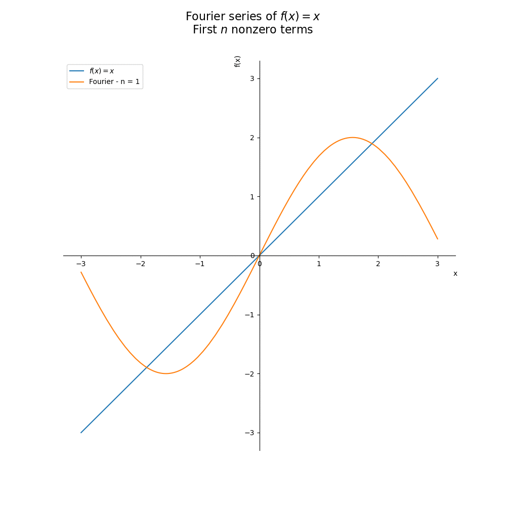

# Fourier

[](https://www.linkedin.com/in/flsbustamante/) 
[](https://www.python.org/) 
[](https://github.com/chicolucio/fourier/issues)



A simple Python project to show how Fourier series higher orders gives better
convergence.

This project aims to be educational.

## Usage

1. clone the repo, not a package yet :-(
2. create a virtual environment with Python 3.8+
3. activate the virtual environment
4. install dependencies
5. run the scripts

```bash
git clone https://github.com/chicolucio/fourier
cd fourier
python -m venv .venv
source .venv/bin/activate
pip install -r requirements.txt
python fourier_animation.py
```

Example function: f(x) = x.

<!-- ## Testing

Tests can be run in the top-level directory with the command `pytest -v tests/`. -->

## Contributing

All contributions are welcome.

**Issues**

Feel free to submit issues regarding:

- recommendations
- more animations or examples
- enhancement requests and new useful features
- code bugs

<!-- There are some open issues waiting for your help, see
[here](https://github.com/chicolucio/fourier/issues). -->

**Pull requests**

- before starting to work on your pull request, please submit an issue first
- fork the repo
- clone the project to your own machine
- commit changes to your own branch
- push your work back up to your fork
- submit a pull request so that your changes can be reviewed

## License

MIT, see [LICENSE](LICENSE)

## Citing

If you use this project in a scientific publication or in classes, please consider citing as

F. L. S. Bustamante, Fourier, 2022 - Available at: https://github.com/chicolucio/fourier

## More

- [LinkedIn](https://www.linkedin.com/in/flsbustamante/)
- [Portfolio](https://franciscobustamante.com.br/portfolio)
- [Curriculum Vitae](https://franciscobustamante.com.br/about/)
